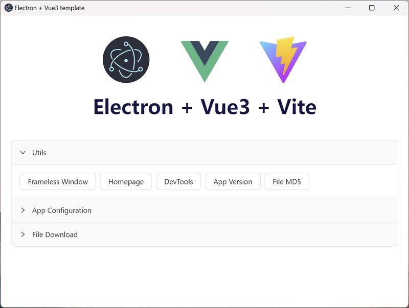
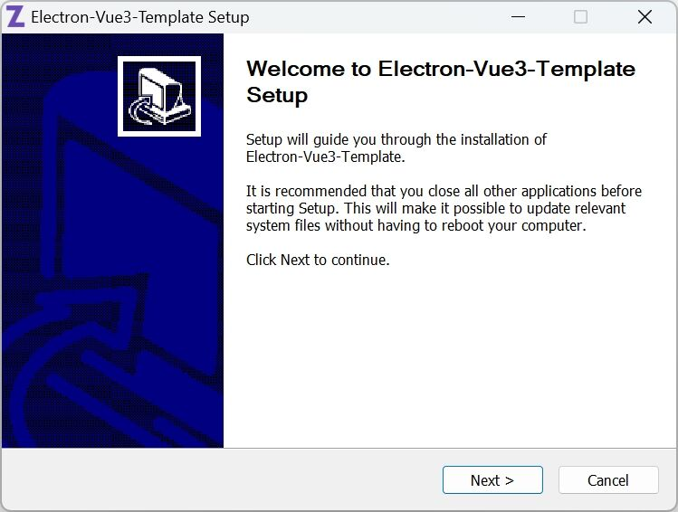
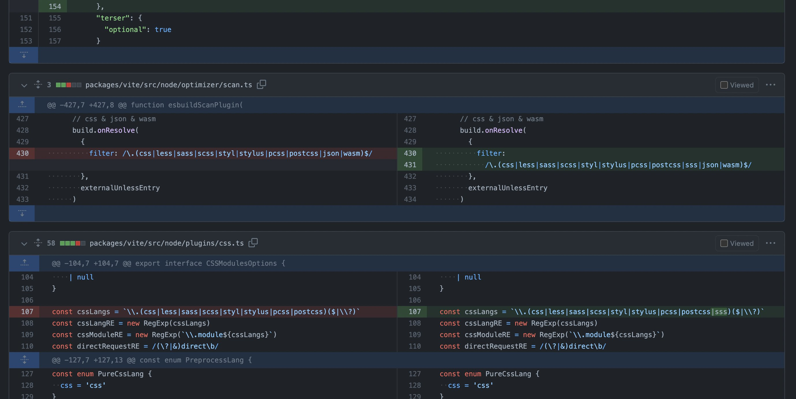
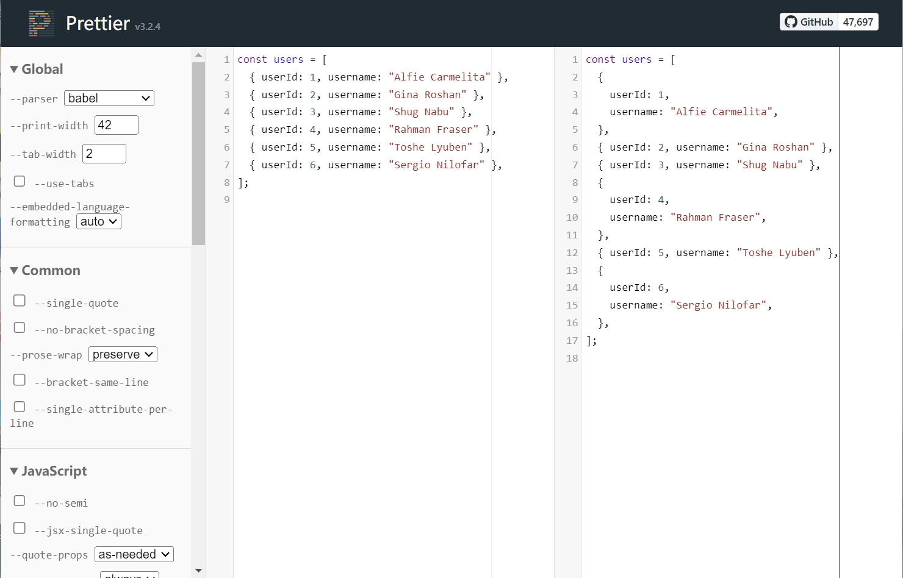

# 1. electron-vue3-template
基于**Vue3** + **Electron** + **TypeScript**的客户端程序模板，使用**Vite**和**Electron Forge**构建和打包。

真正做到开箱即用，面向跨平台客户端设计，产品级的项目模板。



## 1.1 特性

- 使用[ViteJS](https://vitejs.dev)构建和驱动前端页面，支持热加载（HMR），使开发和调试变得更加高效 ⚡
- 支持Vue3多页面，提供页面创建指令，适合客户端开发场景 💖
- 支持Electron窗口创建指令，并且可隔离不同窗口的IPC事件 💖
- 封装简化了IPC的调用方式，并提供了IPC函数快速创建指令，主进程与渲染进程的相互调用从未如此简单 👍
- 主进程和渲染进程支持热加载 ⚡
- 精选依赖包，提升项目稳定性
- 代码简洁，易掌控，可定制性强
- 日志文件，主进程和渲染进程可以直接写文件日志
- 配置文件
- 主进程和渲染进程均支持axios HTTP请求
- 文件下载（含哈希校验、进度反馈），渲染进程可直接异步调用 👍
- 功能完善的无边框窗口
- 托盘图标和右键菜单，窗口关闭时程序最小化到托盘
- 客户端程序单实例
- 基于ESLint的代码规范和自动格式化
- 使用Electron官方推荐的[Electron Forge](https://www.electronforge.io/)进行客户端构建和打包
- 支持NSIS安装包 😎
- ......

## 1.2 快速开始 🌈

点击右上角绿色的 **Use this template** 按钮，使用该模板创建一个新的仓库并克隆到本地。

**或者..**

直接克隆该项目: `git clone https://github.com/winsoft666/electron-vue3-template.git`

### Visual Studio Code
推荐使用`Visual Studio Code`进行项目开发，并安装如下插件：
- ESLint
- Vue Language Features (Volar)

### 安装依赖 ⏬

```bash
yarn install
```

### 开发 ⚒️

```bash
yarn run dev
```

### 其他命令

```bash
yarn run dev # 启动应用并支持热加载
yarn run build # 构建应用，可发布的包位于"out\make"目录

# 或者
yarn run build:win32 # 构建Windows平台 32位应用
yarn run build:win64 # 构建Windows平台 64位应用
yarn run build:mac # 构建macOS平台应用
yarn run build:linux # 构建Linux平台应用

yarn run new:page  # 创建新的Vue页面
yarn run new:window # 创建新的Electron窗口
```

更多的可选配置项可以参考 [Electron Forge CLI docs](https://www.electronforge.io/cli)。

### NSIS安装包 🪟
需要先手动下载和安装NSIS：
[https://nsis.sourceforge.io/Download](https://nsis.sourceforge.io/Download)

使用如下命令构建Windows平台 32位应用（如需构建64位应用，则需要手动修改`win-setup-x86.nsi`脚本）：
```bash
yarn run build:win32
```

运行NSIS安装目录内的`makensisw.exe`。

依次点击`File -> Load Script...`，选择并加载本项目的`setup\NSIS\win-setup-x86.nsi`脚本。

最后，执行`Recompile`命令即可编译生成安装包。



# 2. 项目介绍
## 2.1 工程结构 🌳

```yaml
- scripts/         # 该目录中的脚本用构建应用程序和驱动前端页面
- screenshots      # 本文档中用到的截图
- setup/            # 存储编译和构建相关文件
  - NSIS/                # NSIS安装包脚本
  - exe.ico             # 构建后的可执行文件图标（非安装包图标）
  - install.ico        # NSIS安装包图标
  - uninstall.ico      # NSIS卸载程序图标
- src/
  - lib/            # 公共库，为了方便修改，未做成独立的包
    - file-download/    # 文件下载库
      - main                 # 仅供主进程使用
      - renderer            # 仅供渲染进程使用
      - shared               # 主进程和渲染进程都可以使用
    - utils/            # 公共代码库
  - main/           # 主进程的代码 (Electron)
    - static/          # 静态资源
    - windows/         # 多窗口文件夹 (每个子目录表示一个窗口)
      - primary/          # 主窗口（客户端通常都会有一个主窗口）
      - frameless/        # 无边框示例窗口
      - ...
  - renderer/      # 渲染进程的代码 (VueJS)
    - public           # 静态资源
    - pages/           # 多页面目录 (强制约定：每个子目录代表一个页面)
      - primary/          # 主窗口页面
      - frameless/        # 无边框示例窗口的页面
      - ...
    - typings/         # ts声明文件
```

## 2.2 使用静态文件

- `src/main/static`目录存放主进程使用的静态文件。
- `src/renderer/public`目录存放渲染进程使用的静态文件。

#### 在主进程中引用静态文件

```ts
// 假设 src/main/static/tray.ico 文件存在
// 使用 appState.mainStaticPath 属性获取主进程的静态文件存储目录
import path from "path";
import appState from "./app-state";

const iconPath = path.join(appState.mainStaticPath, "tray.ico");
```

## 2.3 AppState对象
为了方便在主进程中跨模块访问某些对象（如`primaryWindow`、`tray`、`cfgStore`等）和应用配置（如`onlyAllowSingleInstance`等），我们定义了单实例对象AppState来存储这些数据。

使用方法如下：
```javascript
import appState from "./app-state";

appState.primaryWindow?.show();
```

## 2.4 快速创建Vue页面

执行如下命令，输入页面名称后将自动在`renderer/pages`目录创建子页面，每个子页面的相关代码位于单独的目录中，目录名为我们指定的页面名称（小写）。

```bash
yarn run new:page
```

创建的子页面在代码中通过以下方式访问：
```javascript
// 开发环境
const rendererPort = process.argv[2];
primaryWindow.loadURL(`http://localhost:${rendererPort}/pages/<PAGE-NAME>/index.html`);

// 非开发环境
primaryWindow.loadFile(path.join(app.getAppPath(), "build/renderer/pages/<PAGE-NAME>/index.html"));
```

## 2.5 快速创建Electron窗口
虽然直接构造Electron的BrowerWindow对象就可以创建新的Electron窗口，但为了方便代码管理和ipcMain消息隔离，本模板中的每个窗口都继承自`WindowBase`对象，每个窗口的相关代码位于`src\main\windows\`的不同子目录中，目录名为我们指定的窗口名称（小写）。

```bash
yarn run new:window
```

创建的子窗口默认会访问同名的子页面，可以手动修改代码访问其他页面：
```javascript
if(process.env.NODE_ENV === "development"){
  const rendererPort = process.argv[2];
  primaryWindow.loadURL(`http://localhost:${rendererPort}/pages/primary/index.html`);
}else{
  primaryWindow.loadFile(path.join(app.getAppPath(), "build/renderer/pages/primary/index.html"));
}
```

创建窗口后，需要在`registerIpcMainHandler`方法中注册该窗口的ipcMain事件及处理函数。

如果多个窗口注册了同名的事件，当渲染进程发送该名称的事件到主进程时，所有窗口对象都会收到该事件，为了避免这种情况，我们可以在事件处理函数中使用`isIpcMainEventBelongMe`方法来过滤非本窗口的事件。

```javascript
ipcMain.on("message", (event, message) => {
  if(!this.isIpcMainEventBelongMe(event))
    return;

  console.log(message);
});
```

## 2.6 快速创建IPC函数
在`src\renderer\pages\primary\App.vue`中获取文件MD5的代码如下：
```javascript
async function onGetFileMd5(){
  const result = await utils.showOpenDialog({
    properties: [ "openFile" ],
    filters: [
      { name: "All Files", extensions: [ "*" ] }
    ]
  });

  if(result.filePaths.length > 0){
    utils.getFileMd5(result.filePaths[0])
      .then((md5) => {
        message.success(md5);
      }).catch((e) => {
        message.error(GetErrorMessage(e));
      });
  }
}
```

上述代码通过调用Utils库的`showOpenDialog`、`getFileMd5`函数轻松实现了通知主进程选择文件、计算文件MD5并获取相应结果的操作，代码非常简洁。

但是Utils只预置了部分常用的功能，预置功能肯定无法满足我们产品开发的所有需求。在此情况下，我们可以向Utils库中添加自定义的功能函数，该如何添加了？

不用担心，本模板已经提供了IPC函数快速创建指令：
```bash
yarn run new:ipc
```

执行上面指令后，会出现如下提示：
```txt
Create syntax: CallWay,FunctionName,FunctionType
Call Way:
        rm = Renderer process call the function of main process
        mr = Main process call the function of renderer process (Ignore FunctionType)
Function Name:
        xxx-xxx-xxx
Function Type:
        a = Asynchronous call without result
        ap = Asynchronous call with promise result
        s = Synchronous call with result
```

参数1（CallWay）表示函数调用方向：
- rm 表示渲染进程调用主进程的函数，可以支持同步调用、异步调用，并且可以返回Promise结果。
- mr 表示主进程调用渲染进程的函数，该方向只能是异步调用，而且不支持返回结果，会忽略第三个参数（FunctionType）。

参数2（FunctionName）表示函数名称，函数名称的单词间使用`-`分隔，如`GetFileSha256`需要指定为`get-file-sha256`。

参数3（FunctionType）函数类型：
- a 表示不返回结果的异步函数
- ap 表示返回Promise结果的异步函数
- s 表示同步函数


### 示例
依次输入如下命令：
```bash
yarn run new:ipc

Input:
rm,get-file-sha256,ap
```

命令执行成功后，会自动在`src\lib\utils\renderer\index.ts`生成`Utils.getFileSha256`函数：

```javascript
public async getFileSha256(){
  return await (window as any).__ElectronUtils__.getFileSha256();
}
```

自动生成的函数都没有指定参数和返回值，需要我们手动添加，如修改后的函数如下：

```javascript
public async getFileSha256(filePath: string) : string {
  return await (window as any).__ElectronUtils__.getFileSha256(filePath) as string;
}
```

在渲染进程中（如App.vue）中可以直接调用该函数：
```javascript
import utils from "../../../lib/utils/renderer";

const sha256 = await utils.getFileSha256("file-path.txt");
```

IPC函数创建指令只会创建函数骨架，不会为我们实现具体的功能，我们还需要在主进程ipcMain处理函数中实现计算文件SHA256的具体功能。

自动生成的主进程ipcMain处理函数如下：

```javascript
ipcMain.handle("electron-utils-get-file-sha256", async(event) => {
});
```

手动添加参数、返回值，及具体的功能代码（此处省略）：
```javascript
ipcMain.handle("electron-utils-get-file-sha256", async(event, filePath: string) : Promise<string> => {
  // .....
});
```

# 3. 代码规范
本项目使用ESLint进行代码检查和格式化，没有使用Prettier进行代码格式化。

原因大体如下：
1. 需要额外的插件和配置来避免ESLint和Prettier的规则冲突。

2. Prettier的`printWidth`配置项会损害代码和Git Diff的可读性。




[在线演示](https://prettier.io/playground/#N4Igxg9gdgLgprEAuc0DOMAEBXNcBOamAvJgNoA6UmmwOe+AkgCZKYCMANPQVAIYBbOGwogAggBsAZgEs4mAMJ98QiTJh9RmAL6cqNOrgIs2AJm5H8-ISJABxGf0wAlCGgAWfKFt37aPJlZMAGYLBmthTFEAZXdsAHNMADk+ACNsHz1qf0sTTAAWMN5BSNFnPncBL0wAMXw+Bky-QwY8gFYiqxLbABU3d3kAGQBPbFSEJuyW4yCANk6I22iCeJkIZJkJCCllSYBdAG4qEE4QCAAHGDWoNGRQZXwIAHcABWUEW5Q+CSe+YdvTql6mAANZwGDREqDRxwZA7CR4QHAsEQ858MCOeLIGD4bBwU5wATjZjMODMQZeeLYPjxOA1CAqPgwK5QLFfbAwCAnEDuGACCQAdXc6jgaDRYDgyxu6hkADd1MNkOA0ACQI4GDAXvV4lU4d9ESAAFZoAAe0UxEjgAEVsBB4HqEfiQGjCAQlak0nAJNzzvhHDABTJmDB3Mh8uZnY88AL6uclb7RQRZbDTgBHW3wLUXT4gBoAWigcDJZO5+Dg6ZkZa1NN1SHhBrwAhk2NxTrQFutGdhdf1To0qUDwdDSAjOL4m0xCggAlrIFFbW5Rh6aU+9adsrxjCgpNg0TAfsuYm30Rgw0tDrw2m0QA)

# 4. 依赖包 🎈
## 4.1 基本原则

> 一个构建在众多不稳定性因素下的项目，是没有稳定性可言的。

为了保证项目的稳定性，本模板项目只使用具有知名度、稳定性强的依赖包（库），如`electron-log`等。

对于作者自己写的库（如`file-download`等），统一以源码形式提供在`src\lib\`目录，方便模板使用者进行bug修复和功能扩充，在使用时直接采用相对路径进行导入即可。

## 4.2 dependencies和devDependencies的区别
由于Electron Forge会将`dependencies`中的所有依赖项都进行打包，因此为了减少安装包的体积，我们只将主进程需要使用的依赖安装到`dependencies`项下，而其他的依赖均安装到`devDependencies`。

如将vue作为开发依赖进行安装：

```bash
yarn add -D vue
```

## 4.3 依赖包说明

> 作为开发者，应知晓每个依赖包的用途，避免node_modules黑洞的产生。

- unplugin-vue-components
实现自动按需引入AntDesign-Vue组件。

- electron-log
提供本地日志文件的打印和输出。

- electron-store
提供本地配置文件的读取和写入功能。

- @fortawesome-*
提供对FontAwesome图标字体的支持。

- uuid
使用uuid字符串，在file-download库中使用。

- chalk
用于在命令行终端输出带颜色样式的字符串，仅在`scripts\*.js`中使用。

- chokidar
轻量级的文件监控组件，用于实现热加载，仅在`scripts\*.js`中使用。

- @electron-forge/*
与Electron Forge构建和打包相关的依赖包，除了`@electron-forge/cli`是必须的，其他的可以根据`forge.config.js -> makers`的配置按需引用。

- axios
异步HTTP网络请求组件

# 5. 客户端版本号
使用`package.json`文件的`version`字段标识客户端的版本号，在主进程内可以通过`appState.appVersion`属性获取。

💡 不需要设置`forge.config.js`文件的`appVersion`字段。

在渲染进程可以直接使用`utils.getAppVersion()`获取版本号。
```javascript
import utils from "../../../lib/utils/renderer";

console.log(utils.getAppVersion());
```

# 6. 期待你的反馈 🥳
个人能力有限，代码不免有错误和不足之处，欢迎提交issue和PR。

如果这个项目对你有帮助，无需捐助，点击右上角Star ⭐让我知道就可以了。